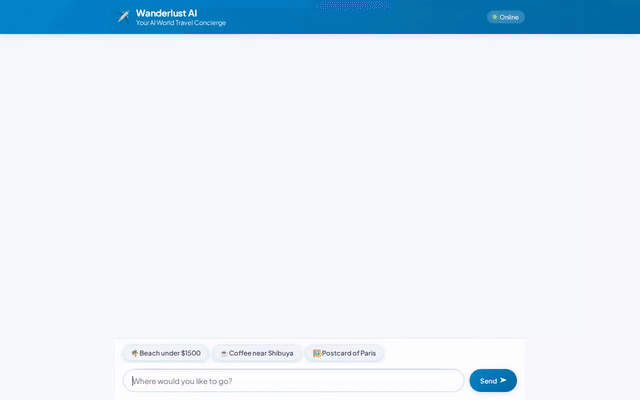

# Wanderlust AI ✈️ World Concierge

An intelligent AI travel concierge agent built with Google Agent Development Kit (ADK), Gemini 2.5 Flash, Vertex AI Memory Bank, Cloud Firestore, Google Cloud Storage, Google Maps Platform, and A2UI (Agent-to-User Interface).



---

## Capabilities & Architecture

Wanderlust AI provides a personalized travel planning experience through the following integrated Google Cloud and ADK services:

- **Vertex AI Memory Bank Service**: Cross-session memory persistence for user travel preferences and dietary allergies (`remember_user_allergy`).
- **Cloud Firestore**: Database lookups for destination search and detailed travel recommendations (`search_destinations`, `get_destination_details`).
- **Google Cloud Storage & Gemini Image Generation**: On-demand postcard/travel photo generation saved to Google Cloud Storage (`generate_destination_image`).
- **Agent Sandbox Code Executor**: Python code execution environment for computing accurate trip budgets (`calculate_trip_budget`).
- **Google Maps Platform (Geocoding & Places API New)**: Geocoding and location search for finding points of interest near specific landmarks (`get_address_coordinates`, `find_nearby_places`).
- **A2UI v0.8 (Basic Catalog)**: Dynamic, rich UI component generation rendered seamlessly in the frontend web chat interface via `a2ui_callback`.

---

## Project Structure

```
wanderlust-ai/
├── app/
│   ├── agent.py          # ADK ReAct agent, tools, and Vertex AI integrations
│   └── a2ui_utils.py     # A2UI model callback wrapper
├── frontend/
│   ├── main.py           # FastAPI proxy server interfacing with Agent Platform
│   └── static/index.html # Plain HTML/CSS/JS frontend with A2UI renderer
├── seed_firestore.py     # Firestore destination seeder
├── agents-cli-manifest.yaml
└── pyproject.toml
```

---

## Local Setup & Running Instructions

### Prerequisites
- **Python 3.10+** and `uv` package manager
- **Google Cloud SDK** (`gcloud`) authenticated to your GCP project with access to Vertex AI, Firestore, and Cloud Storage.

### 1. Install Dependencies
```bash
uv sync
```

### 2. Configure Environment
Create a `.env` file in the project root:
```bash
GOOGLE_MAPS_API_KEY="YOUR_KEY"
```

### 3. Seed Firestore Database (Optional)
```bash
uv run python seed_firestore.py
```

### 4. Run Frontend Locally
Navigate to the `frontend/` directory and start the proxy server:
```bash
cd frontend
uv run python main.py
```
Then open your web browser and navigate to port `8080` on `localhost`.

---

## Deployment Instructions

### Deploy Agent to Agent Platform / Vertex AI Reasoning Engine
```bash
agents-cli deploy --update-env-vars GOOGLE_MAPS_API_KEY="YOUR_KEY"
```

### Deploy Frontend Proxy to Cloud Run
```bash
cd frontend
gcloud run deploy wanderlust-ai-frontend \
  --source . \
  --region us-central1 \
  --allow-unauthenticated
```
